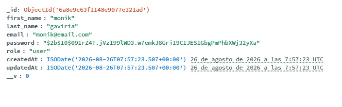
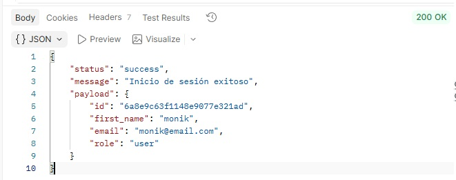
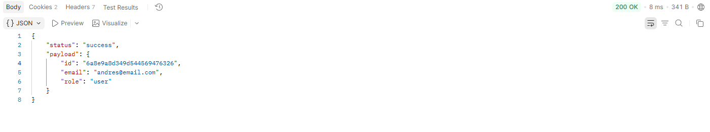

# TAREA1 - BACKEND2

## 📌 Temática Elegida
 API REST para la gestión y reserva de zonas comunes en unidad residencial.

---

## 🛠️ Tecnologías Utilizadas
* **Entorno de ejecución:** Node.js
* **Framework Web:** Express.js
* **Variables de entorno:** Dotenv
* **Arquitectura:** Arquitectura en capas(Controladores, Servicios, Repositorios, DAO)

---

## ⚙️ Requisitos Previos e Instalación

### 1. Clonar el repositorio
```bash
git clone <URL_DE_TU_REPOSITO>
cd <NOMBRE_DE_TU_CARPETA>

2. Instalar dependenciasBashnpm install
🔑 Configuración de Variables de Entorno
Crea un archivo .env en la raíz del proyecto basándote en el siguiente esquema:

PORT=8080
NODE_ENV=development

🚀 Cómo Ejecutar la Aplicación
Modo Producción
Bash
npm start

Modo Desarrollo (con recarga automática)
Bash
npm run dev
El servidor estará escuchando en la URL base: http://localhost:8080 (o el puerto configurado en el archivo .env).
```

---

**Rutas Disponibles (Endpoints)**

| Método | Endpoint | Descripción |
| :--- | :--- | :--- |
| GET | /api/events | Obtiene la lista global de eventos registados. (Pendiente de implementación).|
| POST | /api/sessions/register | Endpoint base para crear un usuario. |
| POST | /api/sessions/login | Endpoint base para inicio de sesión. |
| GET | /api/current | Es una ruta protegida, se debe iniciar sesión previamente para usar esta ruta. |
| POST | /api/sessions/logout | Endpoint base para cierre de sesión |

---


API de Autenticación - Módulo de Sesiones
Documentación técnica para los endpoints de registro e inicio de sesión de la API construida en Express, MongoDB (Mongoose) y arquitectura en capas.

Requisitos Generales
Base URL: http://localhost:8080/api/sessions

Headers requeridos:

HTTP
Content-Type: application/json
Endpoints
1. Registrar Usuario
Registra un nuevo usuario en el sistema. Realiza validaciones de entrada con Zod, encripta la contraseña usando bcryptjs y almacena los datos en MongoDB.

Método: POST

URL: http://localhost:8080/api/sessions/register

Cuerpo de la Petición (Request Body)
```JSON
{
  "first_name": "monik",
  "last_name": "gaviria",
  "email": "monik@email.com",
  "password": "123456"
}
```

Respuesta Exitosa (201 Created)
```JSON
{
  "status": "success",
  "message": "Usuario registrado correctamente",
  "payload": {
    "first_name": "monik",
    "last_name": "gaviria",
    "email": "monik@email.com",
    "role": "user"
  }
}
```


Posibles Respuestas de Error
400 Bad Request: Datos faltantes o formato inválido (Zod Validation Error).

409 Conflict: El correo electrónico ya se encuentra registrado.

---

2. Iniciar Sesión
Autentica a un usuario existente comparando sus credenciales con el hash almacenado en la base de datos.

Método: POST

URL: http://localhost:8080/api/sessions/login

Cuerpo de la Petición (Request Body)
```JSON
{
  "email": "monik@email.com",
  "password": "123456"
}
```

Respuesta Exitosa (200 OK)
```JSON
{
  "status": "success",
  "message": "Inicio de sesión exitoso",
  "payload": {
    "id": "6a8e9c63f1148e9077e321ad",
    "first_name": "monik",
    "email": "monik@email.com",
    "role": "user"
  }
}
```




3. ruta current
Despues de un inicio de sesión se puede ingresar a esta ruta. Se guarda en navegador una cookie. 
Método: GET
URL: http://localhost:8080/api/sessions/current


Respuesta Exitosa (200 OK)
```JSON
{
    "status": "success",
    "payload": {
        "id": "6a8e9a8d349d544569476326",
        "email": "andres@email.com",
        "role": "user"
    }
}
```



Si hay un logout o no se inicio sesion sale el error: 

Respuesta Error (401 Unauthorized)
```JSON
{
    "status": "error",
    "message": "No autorizado: Token no proporcionado"
}
```


Posibles Respuestas de Error
400 Bad Request: Formato de correo o contraseña inválido.

401 Unauthorized: El correo no existe o la contraseña no coincide.

Estructura del Proyecto (Arquitectura en Capas)

```
src/
├── config/          # Variables de entorno y conexión a DB
├── controllers/     # Manejo de req/res HTTP
├── daos/            # Consultas directas con Mongoose
├── middlewares/     # Validación de datos con Zod y errores
├── models/          # Schemas de Mongoose (MongoDB)
├── repositories/    # Abstracción de acceso a datos
├── routers/         # Definición de rutas de la API
├── schemas/         # Esquemas de validación con Zod
├── services/        # Lógica de negocio (bcrypt, reglas de dominio)
└── utils/           # Utilidades de encriptación

```


# API REST Authentication — Architecture & Passport Strategy

API REST modular desarrollada con Node.js y Express, estructurada bajo una arquitectura por capas (**Router, Controller, Service, Repository**) con manejo global de errores y validación estricta de datos.

El sistema implementa un esquema de autenticación sin estado (*stateless*) mediante **JSON Web Tokens (JWT)** almacenados en cookies seguras (`httpOnly`), integrando **Passport.js** y **Zod** para la gestión de identidad y esquemas de entrada.

---

## Architecture Overview

* **Router:** Intercepta la petición HTTP, ejecuta middleware de validación sintáctica (Zod) y aplica middlewares de autenticación (Passport).
* **Controller:** Maneja el ciclo de respuesta HTTP, gestiona el envío/destrucción de cookies de sesión y formatea la salida JSON.
* **Service:** Contiene la lógica de negocio pura (validación de registros duplicados, hash de contraseñas con `bcrypt` y firma de tokens JWT).
* **Repository (DAO):** Capa de abstracción para la interacción directa con la base de datos (MongoDB / Mongoose).
* **Passport Strategies:** Encapsula la lógica de autenticación local e inspección de JWT.

---

## Authentication & Security Setup

1. **Zod Validation:** Valida la estructura y tipos de datos en `req.body` antes de llegar a la lógica de autenticación.
2. **Passport Local Strategy (`register` & `login`):** Intercepta las credenciales, delegando al `UserService` la verificación de hashes bcrypt y la creación del usuario.
3. **Passport JWT Strategy (`jwt`):** Extrae de forma segura la cookie enviada por el navegador mediante un `cookieExtractor` personalizado, verifica la firma del token y carga el payload en `req.user`.
4. **Cookie Strategy (`httpOnly`):** Previene ataques XSS impidiendo el acceso a la cookie desde el contexto de cliente de JavaScript.

---

## Endpoints Documentation

### 1. Register User
Registra un nuevo usuario en la base de datos previa verificación del esquema e inexistencia del email.

* **URL:** `/api/sessions/register`
* **Method:** `POST`
* **Middlewares:** `validateBody(registerSchema)`, `passport.authenticate('register')`
* **Request Body:**
  ````json
  {
    "first_name": "John",
    "last_name": "Doe",
    "email": "john.doe@example.com",
    "password": "SecurePassword123"
  }
  ````
Success Response (201 Created):


````json
{
  "status": "success",
  "message": "Usuario registrado correctamente",
  "payload": {
    "first_name": "John",
    "last_name": "Doe",
    "email": "john.doe@example.com",
    "role": "user"
  }
}
````

### 2. Login User
Verifica las credenciales del usuario, genera un token JWT firmado y establece la cookie token en la respuesta HTTP.

* **URL:**  /api/sessions/login

* **Method:** POST

* **Middlewares:** validateBody(loginSchema), passport.authenticate('login')

### Request Body:
````json
{
  "email": "john.doe@example.com",
  "password": "SecurePassword123"
}
````

Success Response (200 OK)
````json
{
  "status": "success",
  "message": "Inicio de sesión exitoso",
  "payload": {
    "id": "668e9c63f1148e9077e321ad",
    "email": "john.doe@example.com",
    "role": "user"
  }
}
````

### 3. Get Current User Session (Protected Route)
Obtiene la información del usuario autenticado leyendo la cookie de sesión activa.

* **URL:** /api/sessions/current

* **Method:** GET

* **Middlewares:** passport.authenticate('jwt', { session: false })

* **Headers:** Cookie automática agregada por el navegador o Postman (token=...).

Success Response (200 OK)
````json
{
  "status": "success",
  "payload": {
    "id": "668e9c63f1148e9077e321ad",
    "email": "john.doe@example.com",
    "role": "user"
  }
}
````

Error Response (401 Unauthorized)

````json
{
  "status": "error",
  "message": "No autorizado: Token no proporcionado o inválido"
}
````

### 4. Logout User

Invalida la sesión del cliente destruyendo la cookie almacenada en el navegador.

* **URL:** /api/sessions/logout

* **Method:** POST

Success Response (200 OK)
````JSON
{
  "status": "success",
  "message": "Sesión cerrada correctamente"
}
````